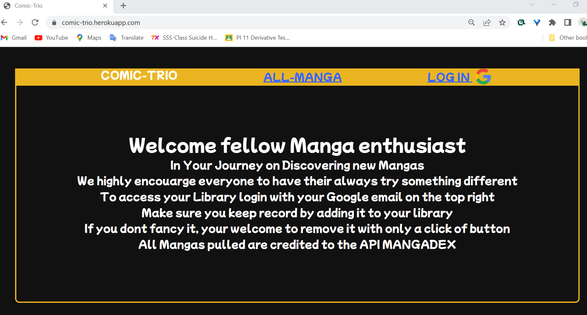
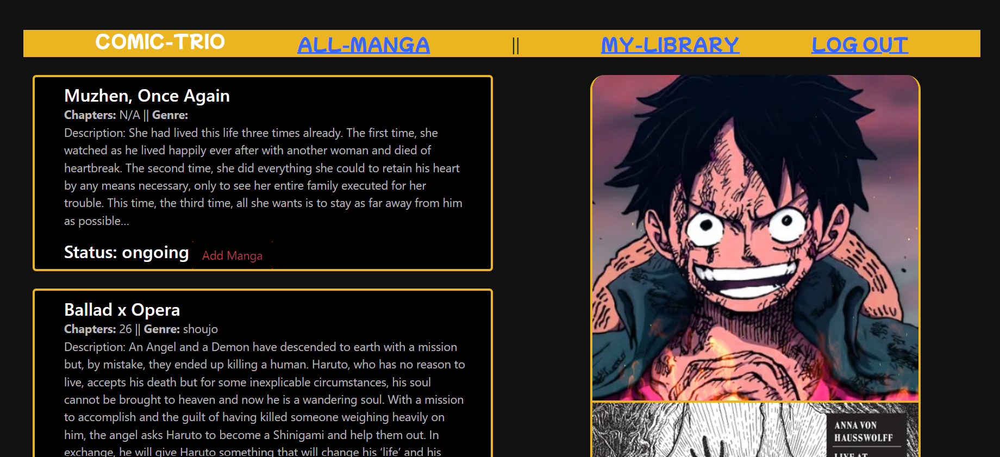
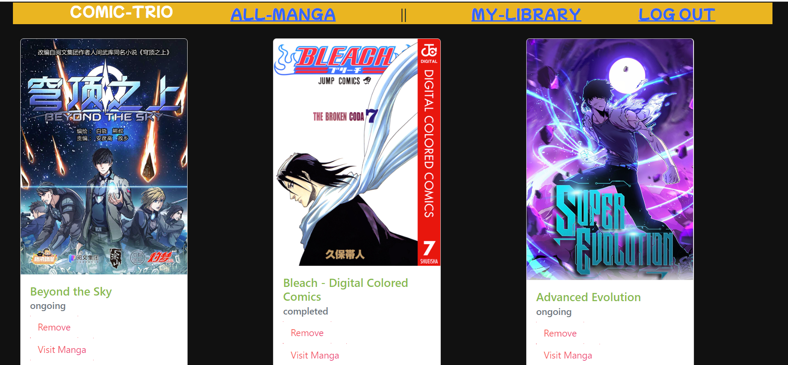
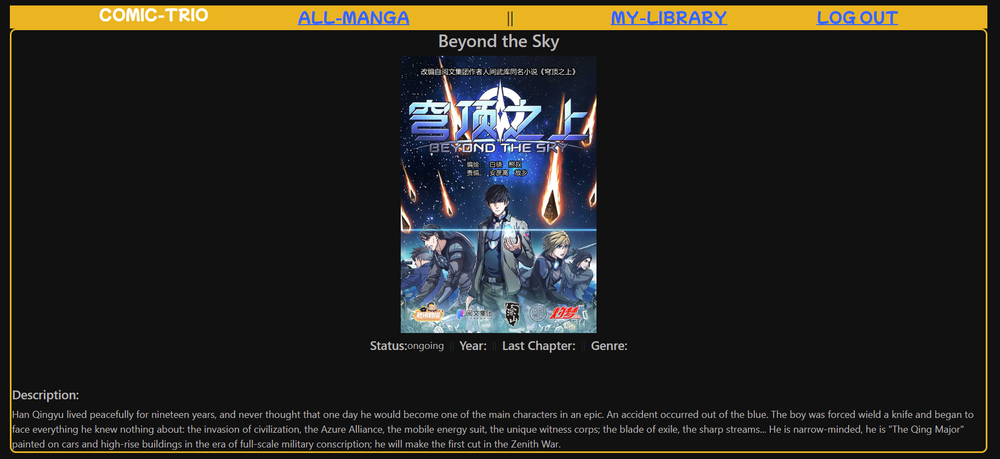

# Comic-Trio
Hello Fellow Manga enthusiast,
- In Your Journey on Discovering new Mangas
- We highly encouarge everyone to have their always try something different, which was brought to you by the Restful API "MANGADEX".
Comic-Trio is a FullStack application where you have a personal Journal in where you can manipulate mangas. To access your Library login with your Google email on the top right. Make sure you keep record by assuring its in your library. The Web Application offers a user-centric exprience you won't need to worry about anyone logging in and disrupting your journal/record. Only the User had the ability to add a Manga and or if the manga is not to your liking, your welcome to remove it with only a click of button.
## ScreenShots
### landing Page

### All Mangas Page

### My libraries Page

### Manga show Page

## Technologies
- RESTFUL API
- Node.js
- Mongoose
- Express
- EJS(Embedded JavaScript Templating)
- CSS
- Bootstrap
- Javascript

## Getting Strated
### Link to the Developed FullStack Application
- <a href="https://comic-trio.herokuapp.com/" target="_blank"> Comic-Trio</a>
### Link to the Planning Trello Board
- <a href="https://trello.com/b/EpUeiWzE/project-2" target="_blank">Trello</a>

## Next Steps
- A search functionality where you can search specific manga
- Comments functionality
- All around a tags Functionality to fetch mangas with the specific tag

